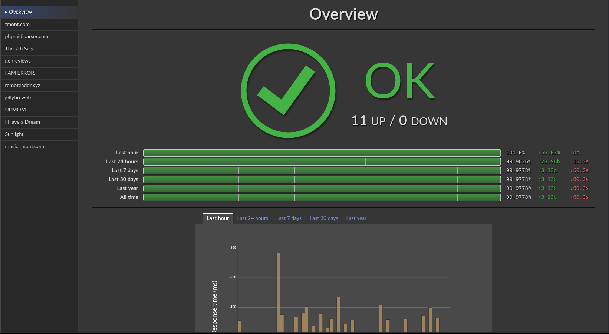
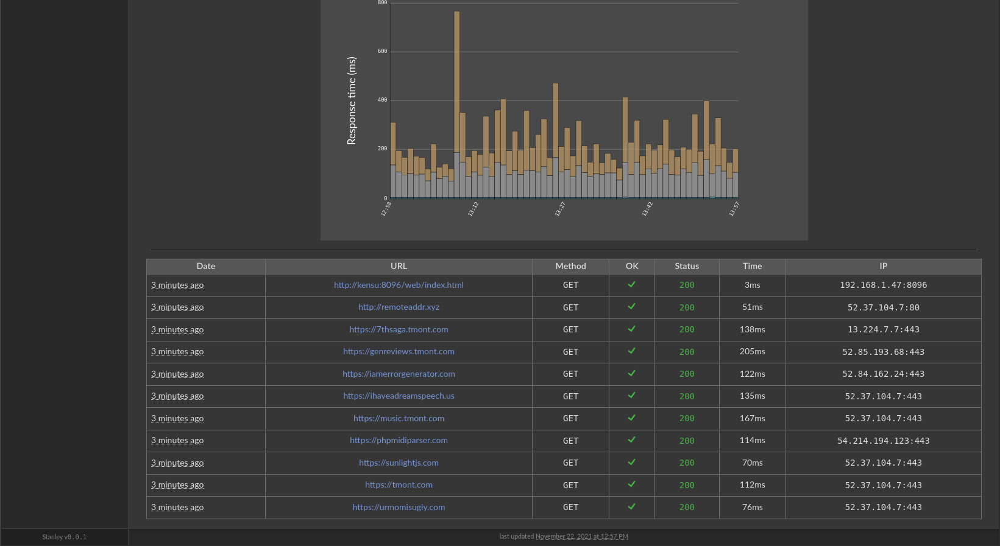

# Stanley

Stanley is a single-file bash script that generates a static status
site. Define a configuration file at `config.txt` like so:

```
An example (https),https://example.com,GET,200
An example (http),http://example.com,GET,200
```

and then run `./stanley.sh --name Example --base-url https://example.com`

A bunch of HTML pages will be generated in `./dist/`.

## Features!
- Response time graphs!
- Multiple time periods!
  - last hour/day/week/month/year!
- Uptime "9s"!
  - with color bars and gradients!
- Huge icons indicating status!
- Atom feed!
- It's just one giant Bash script?
  - Yes!
  - Why not!

## Requirements
- Bash on Linux
- `perl`
- `curl`
- `bc`
- `awk`
- `sed`
- `sqlite3` >= 3.31.1

## Config format
`name,url,http method,expected status code`

- Don't use angle brackets anywhere
- Don't use commas anywhere besides as a delimiter
- Ampersands in URLs will be HTML-escaped
- Ain't nobody got time for proper escaping in a shell language

## Usage
`./stanley.sh --help`

```
Generates uptime status pages

Stanley reads in a config file and generates a static HTML website.
The config file is a simple text file where each line is a separate
check in the following format:

name,url,httpMethod,expectedStatusCode

e.g.

An Example,https://example.com,GET,200
Another Example,https://example.org,GET,200

Usage: ./stanley.sh --name <name> --base-url <url> [options]

Options:

  --help, -h        Show this message
  --name name       Name of the overall project/account
  --base-url url    Base URL for use in Atom feed (e.g. https://example.com)
  --output dir      Output directory for generated files (./dist)
  --db file         Path to the SQLite database (./stanley.sqlite)
  --config file     Path to config file (./config.txt)
```

## Screenshots





## Should I use this in production?
No. Use an actual service that you pay for and is professional and stuff.
I made this for fun for my own local servers that are located in my closet.
